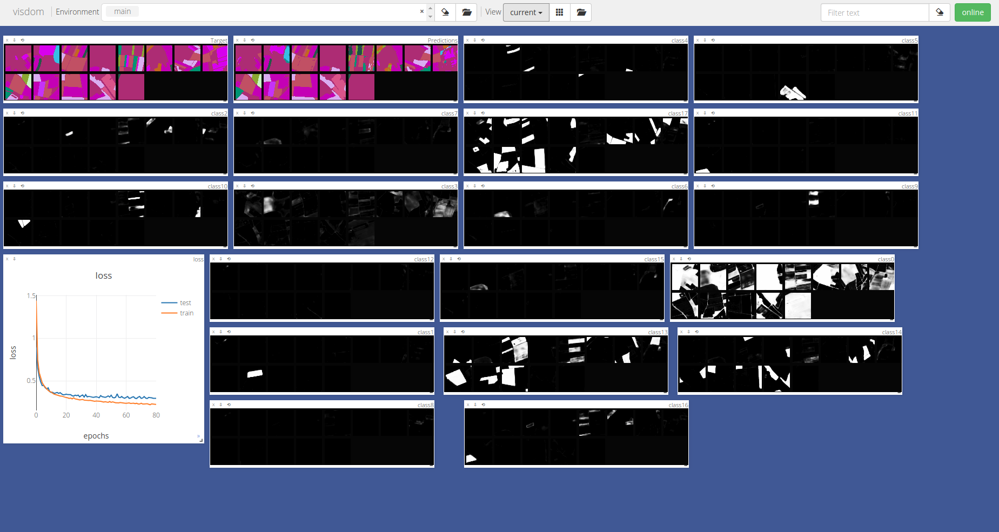

# Pytorch -- Multitemporal Land Cover Classification Network

##### A (yet barebone) Pytorch port of [Rußwurm & Körner (2018)](http://www.mdpi.com/2220-9964/7/4/129/htm) [Tensorflow implementation](https://github.com/TUM-LMF/MTLCC)

Please consider citing
```
Rußwurm M., Körner M. (2018). Multi-Temporal Land Cover Classification with
Sequential Recurrent Encoders. ISPRS International Journal of Geo-Information, 2018.
```
if you use this repository

Activations while encoding sequence:
<p align="center">

</p>

## Dependencies

Python dependencies
```bash
pip install numpy
pip install pandas>=0.23.4
pip install visdom==0.1.8.4
pip install rasterio>=1.0.2

# install pytorch 0.4.1 (https://pytorch.org/)
pip3 install torch torchvision

```

Download dataset to `src/data` and model checkpoint to `src/checkpoints`
```
bash download.sh
```

Train 10 epochs (batchsize 16, dataloader-workers 16) with initialized weights
from checkpoint file `checkpoints/model_00.pth`
```
# add src folder to python path
export PYTHONPATH="$PATHONPATH:$PWD/src"

# train
python src/train.py data -b 16 -w 16 -s checkpoints/model_00.pth
```

## [Visdom](https://github.com/facebookresearch/visdom) Support

Start visdom server in `screen`, `tmux` or other terminal with `$ visdom`
and open `http://localhost:8097` in the browser while training

<p align="center">

</p>


## Comparison to Tensorflow implementation

not yet implemented features compared to the Tensorflow version

* ConvGRU integration in `train.py`
* bidirectional RNN loop
* masking of the background class

### Source of ConvLSTM and ConvGRU implementations

* ConvLSTM cell implementation from `https://github.com/ndrplz/ConvLSTM_pytorch`
* (not used yet) ConvGRU cell implementation from `https://github.com/bionick87/ConvGRUCell-pytorch`
